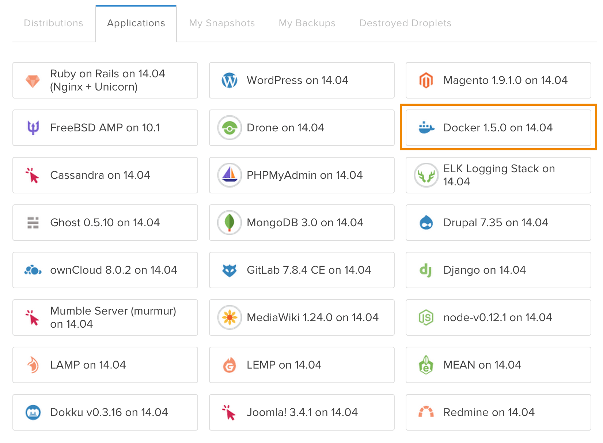

May as well start simple, hey? I wanted to start a blog to help organize my thoughts in a public way, because surely I'm not the only one who can benefit from what I learn. Scott Hanselman talks about wasting your keystrokes:

http://www.hanselman.com/blog/DoTheyDeserveTheGiftOfYourKeystrokes.aspx

I hate waste of any kind, but time especially. So here we go.

## Docker and Digital Ocean <3

As you may have already determined, I'm running this blog using the ghost blogging platform inside of a [Docker container](https://docs.docker.com/userguide/dockerizing/). In case you don't know, Docker is a great way to "containerize" your apps, meaning you can define the application's environment alongside your app code. This is super great for ensuring consistency among your teammates, not to mention you avoid polluting your host machine with all kinds of dependencies. I don't know about you, but I hate **globally** changing PHP + Apache versions, booting redis, installing npm packages, etc. just to satisfy different project requirements (note the emphasis on **globally**; obviously, you'll need to satisfy your project's requirements by using the right tools). Docker is great for providing that much-needed isolation. [See here](https://docs.docker.com/installation/) for installation instructions.

To start, I booted up a Digital Ocean droplet preconfigured with Docker:



Note that I chose the Docker starting point instead of the Ghost droplet in the left column. I did this because I'll be sharing this droplet with other containerized apps, so I wanted to keep the host environment clean and stripped down.

Next, I created a super-simple Dockerfile that looks like this:

```
FROM ghost
```

## Docker Compose for Orchestration

Here's where things start to get cool. By default, your data is not persisted in a Docker container. Only files you share in what Docker calls a "volume" will be persisted. Obviously, I want this blog to live on even if I screw up the container somehow. So of course, I need set up a volume. However, my preference is to go one step further and store persisted data in its own volume container and link it to the app container. For that, a tool called [**Docker Compose**](https://docs.docker.com/compose/) (formerly Fig) makes things super easy. Here's my docker-compose.yml:

```
ghost:
  build: .
  ports:
    - "8000:2368"
  volumes_from:
    - ghostdata
  environment:
    NODE_ENV: production

ghostdata:
  image: busybox:ubuntu-14.04
  command: "true"
  volumes:
    - /var/lib/ghost
```

Note how I'm mapping the host port 8000 to the container port 2368 (Ghost's default port), and using the "volumes from" the ghostdata container. And voila! We get persisted data. Note that the data container is using a very small image with a command that executes successfully so the data container is not actually ever _running_. Cool.

[See here](https://docs.docker.com/userguide/dockervolumes/) for more info on Docker data management.

At this point, I wanted to start customizing the config.js file Ghost ships with. That was easy enough; just create a config.js in the same host directory as the Dockerfile, and add the current directory as a volume to the ghost container. That looks like this in docker-compose.yml:

```
ghost:
...
  volumes:
    - ./:/var/lib/ghost
```

Unfortunately, the ghost container wasn't honouring the volume. I'm not sure if this is a bug in Ghost's build process for the container, or in Docker itself. I need to investigate some more. To get around this, I added config.js explicitly as a volume:

```
volumes:
  - ./config.js:/var/lib/ghost/config.js
```

That worked great.

Next, I started customizing the default casper theme to add prismjs (for syntax highlighting), integration with Disqus, and other tweaks. Rather than copy the whole theme into the host directory, I chose to add individual theme files and add them as explicit volumes, like so:

```
ghost:
...
  volumes:
    ...
    - ./themes/casper/post.hbs:/var/lib/ghost/themes/casper/post.hbs
    - ./themes/casper/default.hbs:/var/lib/ghost/themes/casper/default.hbs
    - ./themes/casper/partials/loop.hbs:/var/lib/ghost/themes/casper/partials/loop.hbs
    - ./themes/casper/assets/css/prism.css:/var/lib/ghost/themes/casper/assets/css/prism.css
    - ./themes/casper/assets/js/prism.js:/var/lib/ghost/themes/casper/assets/css/prism.js
```

And that sums up the config. Now it was time to fire it up! This was as simple as running `docker-compose build && docker-compose up -d` in the directory where docker-compose.yml lives. Once I logged in to the Ghost admin and ran through the basic settings, I was happy.

## Supervisord

Finally, I wanted to ensure the blog would keep running in the event of a container failure or host machine reboot. For that, I installed **supervisord** on the host machine and added this config:

```
[program:marty_blog]
command=/usr/local/bin/docker-compose up
directory=/path/to/marty_blog
autostart=true
autorestart=true
```

Then I ran `supervisord` to kick things off. Now when I update the blog files or configuration, I can run `docker-compose build && docker-compose stop` and supervisord will take care of restarting the containers. Schawing!

All in all, I'm pretty happy with the workflow for running this blog containerized. A few hiccups were encountered, but using Docker significantly helped ease the mental burden for me of getting this blog running. Shoot me a comment if you have any questions or corrections, and thanks for reading!

<sub>Note: You may have noticed that I set the host port of the Ghost container to 8000, yet you're accessing this blog on the standard port 80. To accomplish that, I'm actually running an nginx container as a reverse proxy. That's how I'm running multiple apps on the same host with no global clutter. Shoot me a comment if you'd like to know how I configured that.</sub>
